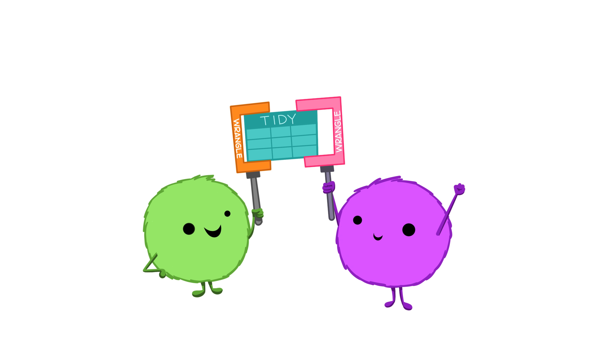

```{r child = "../setup.Rmd"}
```

```{r xaringan-themer, include=FALSE, warning=FALSE}
library(xaringanthemer)
style_mono_light(base_color = "#23395b")
```

```{r packages, echo=FALSE, message=FALSE, warning=FALSE}
library(tidyverse)
library(emo)
library(fontawesome)
library(icons)
```


# Laurie Baker

.pull-left[

.center[


#### Pronouns: She/her
#### Call me: "Laurie", "Professor Baker"

]]
.pull-right[
### Education

`r icons::fontawesome("globe")` Yarmouth, ME

`r icons::fontawesome("graduation-cap")` BSc Marine Biology, University of St. Andrews
`r icons::fontawesome("graduation-cap")` Msc Marine Biology, Dalhousie University
`r icons::fontawesome("graduation-cap")` PhD Epidemiology, University of Glasgow
]

.center[
[`r icons::fontawesome("link")` lauriebaker.rbind.io](https://lauriebaker.rbind.io)
[`r icons::fontawesome("twitter")` @llbaker1707](https://twitter.com/llbaker1707)
[`r icons::icon_style(icons::fontawesome("github"), scale = 1)` @laurielbaker](https://github.com/laurielbaker)
]

???

About Me

* Grew up on Wabanaki lands in Yarmouth, Maine.

* BSc. in Marine Biology at the University of St. Andrews, Scotland

* MSc. in Marine Biology at Dalhousie University, Canada

* PhD. in Epidemiology at University of Glasgow, Scotland

* Head of Faculty, Data Science Campus, Office for National Statistics

* Visiting Assistant Professor of Digital and Computational Studies at Bates College

---

# Laurie Baker

.pull-left[

.center[


#### Pronouns: She/her
#### Call me: "Laurie", "Professor Baker"

]]
.pull-right[

### Research Interests


`r icons::fontawesome("syringe")`  Public Health
`r icons::fontawesome("fish")`  Ecology
`r icons::fontawesome("desktop")` Data Science
`r icons::fontawesome("satellite")` Novel Data Sources

]

.center[
[`r icons::fontawesome("link")` lauriebaker.rbind.io](https://lauriebaker.rbind.io)
[`r icons::fontawesome("twitter")` @llbaker1707](https://twitter.com/llbaker1707)
[`r icons::icon_style(icons::fontawesome("github"), scale = 1)` @laurielbaker](https://github.com/laurielbaker)
]
???
---

# Influence of target species on fishing effort

```{r echo=FALSE, out.width="80%", fig.align="center", fig.cap = "Woman on boat holding a fish and a crab"}
knitr::include_graphics("img/congrio_centolla.jpg")
```

---

# Grey Seal Movement off Nova Scotia

```{r echo=FALSE, out.width="65%", fig.align="center", fig.cap = "Grey seal (Halichoerus grypus) with GPS tag on back of neck and acoustic tag on back"}

```

---
# Grey Seal Movement off Nova Scotia

<iframe src="https://www.google.com/maps/embed?pb=!1m18!1m12!1m3!1d367544.6964222735!2d-60.215552395501966!3d43.97088868870316!2m3!1f0!2f0!3f0!3m2!1i1024!2i768!4f13.1!3m3!1m2!1s0x4b4689632ca41c27%3A0xfcd36f09136414e!2sSable%20Island!5e0!3m2!1sen!2sus!4v1630508253565!5m2!1sen!2sus" width="1000" height="480" style="border:0;" allowfullscreen="" loading="lazy"></iframe>


---

# Spread and control of fox rabies in Europe

```{r echo=FALSE, out.width="60%", fig.align="center", fig.cap = "Map showing rabies retreat from Western Europe"}
knitr::include_graphics("img/rabies_retreat.png")
```

---
# Creating open source learning resources

<iframe src="https://andysouth.shinyapps.io/intro-to-spatial-r/" width="1016" height="516" frameBorder="0"></iframe>

---
# Coding Mitten Patterns

<iframe src="https://laurielbaker.github.io/coded-mittens/selbu_mitten_generator.html" width="1016" height="516" frameBorder="0"></iframe>

---

# Introductions


```{r echo=FALSE, out.width="50%", fig.cap = "Image Credit: R monster mascots by @Allison Horst", fig.align="left"}

```


* Name (and pronouns if you want to share)
* Option 1: Something you recently taught yourself how to do
* Option 2: What item you'd be most excited to find in the free box?

---

# Activity

## Part 1: Get to know one another

* Walk around the room and find three people
* Re-introduce yourselves to your group
* Find something you all have in common
* Continue on until you have formed three groups.

## Part 2: What is this course going to look like?

## Part 3: Open Questions

---

## Data science

.pull-left-wide[
- Data science is an exciting discipline that allows you to turn data into understanding, insight, and knowledge. 

- We're going to learn to do this in a `tidy` way -- more on that later!

- This is a course on programming for analysis and visualization, with an emphasis on statistical thinking.
]

---

## Course FAQ

.pull-left-wide[
**Q - What data science background does this course assume?**  
A - None.

**Q - Is this an intro stat course?**  
A - While statistics $\ne$ data science, they are very closely related and have tremendous of overlap. Hence, this course is a great way to get started with statistics. However this course is *not* your typical high school statistics course and there is a greater emphasis on data visualization.

**Q - Will we be doing computing?**   
A - Yes.
]

---

## Course FAQ

.pull-left-wide[
**Q - Is this an intro CS course?**  
A - No, but many themes are shared.

**Q - What computing language will we learn?**  
A - R.

**Q: Why not language X?**  
A: We can discuss that over `r emo::ji("coffee")`.
]

---
# One link to rule them all...

... where you can find everything except your course grades!

[https://coa-dataviz.netlify.app/](https://coa-dataviz.netlify.app/)

Bookmark the link!

???
This link is going to have everything but your course grades. It will link you to the relevant places including lyceum.

The course material will be released on a weekly basis, this is so that you can take a look at the week ahead. There are links to videos, readings and others. I try to keep these links up to date but I may occasionally miss something and I'd love to hear from you if you have trouble.

---

class: middle

# Software

---

```{r echo=FALSE, out.width="75%", fig.align="left"}
knitr::include_graphics("img/excel.png")
```

???

Before I did my undergraduate this is what data analysis mostly meant to me. Now this form of data in rows and columns may be familiar to some of you if you have worked with excel and spreadsheets. Now many of us if we are collecting data like to put it into something like this. 

So data that comes in a tabular format like this might be familiar to you. 

---

```{r echo=FALSE, out.width="50%", fig.align="left"}
knitr::include_graphics("img/r.png")
```

???
When I did my undergraduate thesis and started learning R this is what R looked like. I remember thinking of the interface as a black box and I wasn't really sure where the data was contained.  

---

```{r echo=FALSE, out.width="73%", fig.align="left"}
knitr::include_graphics("img/rstudio.png")
```

???

In this course we are going to be using something a little bit different. We are going to be using Posit to interact with the computing language. If you remember the images from the previous two slides you can see that Posit combines those two components so that you can view the data and also execute code in the console. Posit is the Integrated Development Environment (IDE) that we are going to use in this course.

---

class: middle

# Data science life cycle

---

```{r echo=FALSE, out.width="90%", fig.align="left"}
knitr::include_graphics("img/data-science-cycle/data-science-cycle.001.png")
```

???
Let's also talk about the Data Science Life Cycle. This is the diagram from the book R for Data Science that we'll be referring to throughout the course. Note that this isn't the only diagram out there representing the data science life cycle but it is the one that we are using to structure this course. 

So how does the data science life cycle begin?
---

```{r echo=FALSE, out.width="90%", fig.align="left"}
knitr::include_graphics("img/data-science-cycle/data-science-cycle.002.png")
```

???
Usually you have some data maybe in a spreadsheet or a database and you need to import into R.

---

```{r echo=FALSE, out.width="90%", fig.align="left"}
knitr::include_graphics("img/data-science-cycle/data-science-cycle.003.png")
```

???

Then we need to spend some time organising that data to make it easier to use and analyse. This often includes doublechecking the data for mistakes and tidying it and it may also include transforming it to get it to the table that you want, that makes it easier to use or analyse. 

---

```{r echo=FALSE, out.width="90%", fig.align="left"}
knitr::include_graphics("img/data-science-cycle/data-science-cycle.004.png")
```

???

Once the data is in a format that is easy to work with, you want to visualize your data to start to gain some insights from it. 
---

```{r echo=FALSE, out.width="90%", fig.align="left"}
knitr::include_graphics("img/data-science-cycle/data-science-cycle.005.png")
```

???
Then, perhaps you will go onto modelling your data.

---

```{r echo=FALSE, out.width="90%", fig.align="left"}
knitr::include_graphics("img/data-science-cycle/data-science-cycle.006.png")
```

???
And the reality is it never ends there. You will gain more insight into the data and you may need to go back and check and adjust your assumptions. 

That last step is communicating your results and finding. 


---
## Acknowledgements

* This course builds on the materials from [Data Science in a Box](https://datasciencebox.org/) developed by Mine Çetinkaya-Rundel and are adapted under the [Creative Commons Attribution Share Alike 4.0 International](https://github.com/rstudio-education/datascience-box/blob/master/LICENSE.md)
