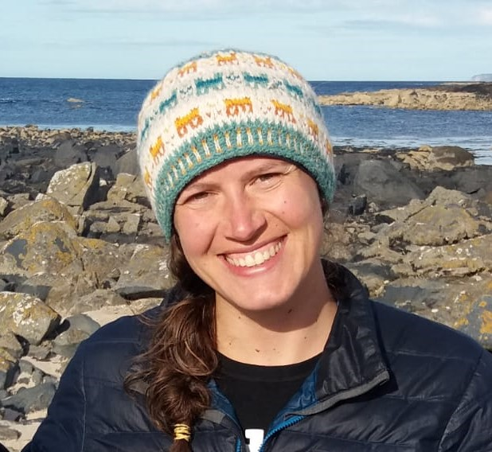

```{r child = "../setup.Rmd"}
```

```{r xaringan-themer, include=FALSE, warning=FALSE}
library(xaringanthemer)
style_mono_light(base_color = "#23395b")
```

```{r packages, echo=FALSE, message=FALSE, warning=FALSE}
library(tidyverse)
library(emo)
library(fontawesome)
library(icons)
```


# Laurie Baker

.pull-left[

.center[


#### Pronouns: She/her
#### Call me: "Laurie", "Professor Baker"

]]
.pull-right[
### Education

`r icons::fontawesome("globe")` Yarmouth, ME

`r icons::fontawesome("graduation-cap")` BSc Marine Biology, University of St. Andrews
`r icons::fontawesome("graduation-cap")` Msc Marine Biology, Dalhousie University
`r icons::fontawesome("graduation-cap")` PhD Epidemiology, University of Glasgow
]

.center[
[`r icons::fontawesome("link")` lauriebaker.rbind.io](https://lauriebaker.rbind.io)
[`r icons::fontawesome("twitter")` @llbaker1707](https://twitter.com/llbaker1707)
[`r icons::icon_style(icons::fontawesome("github"), scale = 1)` @laurielbaker](https://github.com/laurielbaker)
]

???

About Me

* Grew up on Wabanaki lands in Yarmouth, Maine.

* BSc. in Marine Biology at the University of St. Andrews, Scotland

* MSc. in Marine Biology at Dalhousie University, Canada

* PhD. in Epidemiology at University of Glasgow, Scotland

* Head of Faculty, Data Science Campus, Office for National Statistics

* Visiting Assistant Professor of Digital and Computational Studies at Bates College

---

# Laurie Baker

.pull-left[

.center[


#### Pronouns: She/her
#### Call me: "Laurie", "Professor Baker"

]]
.pull-right[

### Research Interests


`r icons::fontawesome("syringe")`  Public Health
`r icons::fontawesome("fish")`  Ecology
`r icons::fontawesome("desktop")` Data Science
`r icons::fontawesome("satellite")` Novel Data Sources

]

.center[
[`r icons::fontawesome("link")` lauriebaker.rbind.io](https://lauriebaker.rbind.io)
[`r icons::fontawesome("twitter")` @llbaker1707](https://twitter.com/llbaker1707)
[`r icons::icon_style(icons::fontawesome("github"), scale = 1)` @laurielbaker](https://github.com/laurielbaker)
]
???
---

# Influence of target species on fishing effort

```{r echo=FALSE, out.width="80%", fig.align="center", fig.cap = "Woman on boat holding a fish and a crab"}
knitr::include_graphics("img/congrio_centolla.jpg")
```

---

# Grey Seal Movement off Nova Scotia

```{r echo=FALSE, out.width="65%", fig.align="center", fig.cap = "Grey seal (Halichoerus grypus) with GPS tag on back of neck and acoustic tag on back"}
knitr::include_graphics("img/grey_seal.jpg")
```

---
# Grey Seal Movement off Nova Scotia

<iframe src="https://www.google.com/maps/embed?pb=!1m18!1m12!1m3!1d367544.6964222735!2d-60.215552395501966!3d43.97088868870316!2m3!1f0!2f0!3f0!3m2!1i1024!2i768!4f13.1!3m3!1m2!1s0x4b4689632ca41c27%3A0xfcd36f09136414e!2sSable%20Island!5e0!3m2!1sen!2sus!4v1630508253565!5m2!1sen!2sus" width="1000" height="480" style="border:0;" allowfullscreen="" loading="lazy"></iframe>


---

# Spread and control of fox rabies in Europe

```{r echo=FALSE, out.width="60%", fig.align="center", fig.cap = "Map showing rabies retreat from Western Europe"}
knitr::include_graphics("img/rabies_retreat.png")
```

---
# Creating open source learning resources

<iframe src="https://andysouth.shinyapps.io/intro-to-spatial-r/" width="1016" height="516" frameBorder="0"></iframe>

---
# Coding Mitten Patterns

<iframe src="https://laurielbaker.github.io/coded-mittens/selbu_mitten_generator.html" width="1016" height="516" frameBorder="0"></iframe>

---

# Introductions


```{r echo=FALSE, out.width="50%", fig.cap = "Image Credit: R monster mascots by @Allison Horst", fig.align="left"}
knitr::include_graphics("img/avatar.jpg")
```


* Name (and pronouns if you want to share)
* Option 1: Something you recently taught yourself how to do
* Option 2: What item you'd be most excited to find in the free box?

---

# Activity

## Part 1: Get to know one another

* Walk around the room and find three people
* Re-introduce yourselves to your group
* Find something you all have in common
* Continue on until you have formed three groups.

## Part 2: What is this course going to look like?

## Part 3: What are we excited and nervous about?

## Part 4: Open Questions

---

## Data science

.pull-left-wide[
- Data science is an exciting discipline that allows you to turn data into understanding, insight, and knowledge. 

- We're going to learn to do this in a `tidy` way -- more on that later!

- This is a course on programming for analysis and visualization, with an emphasis on statistical thinking.
]

---

## Course FAQ

.pull-left-wide[
**Q - What data science background does this course assume?**  
A - None.

**Q - Is this an intro stat course?**  
A - While statistics $\ne$ data science, they are very closely related and have tremendous of overlap. Hence, this course is a great way to get started with statistics. However this course is *not* your typical high school statistics course and there is a greater emphasis on data visualization.

**Q - Will we be doing computing?**   
A - Yes.
]

---

## Course FAQ

.pull-left-wide[
**Q - Is this an intro CS course?**  
A - No, but many themes are shared.

**Q - What computing language will we learn?**  
A - R.

**Q: Why not language X?**  
A: We can discuss that over `r emo::ji("coffee")`.
]

---
# One link to rule them all...

... where you can find everything except your course grades!

[https://coa-dataviz.netlify.app/](https://coa-dataviz.netlify.app/)

Bookmark the link!

???
This link is going to have everything but your course grades. It will link you to the relevant places including lyceum.

The course material will be released on a weekly basis, this is so that you can take a look at the week ahead. There are links to videos, readings and others. I try to keep these links up to date but I may occasionally miss something and I'd love to hear from you if you have trouble.

---

class: middle

# Software

---

```{r echo=FALSE, out.width="75%", fig.align="left"}
knitr::include_graphics("img/excel.png")
```

???

Before I did my undergraduate this is what data analysis mostly meant to me. Now this form of data in rows and columns may be familiar to some of you if you have worked with excel and spreadsheets. Now many of us if we are collecting data like to put it into something like this. 

So data that comes in a tabular format like this might be familiar to you. 

---

```{r echo=FALSE, out.width="50%", fig.align="left"}
knitr::include_graphics("img/r.png")
```

???
When I did my undergraduate thesis and started learning R this is what R looked like. I remember thinking of the interface as a black box and I wasn't really sure where the data was contained.  

---

```{r echo=FALSE, out.width="73%", fig.align="left"}
knitr::include_graphics("img/rstudio.png")
```

???

In this course we are going to be using something a little bit different. We are going to be using RStudio to interact with the computing language. If you remember the images from the previous two slides you can see that RStudio combines those two components so that you can view the data and also execute code in the console. RStudio is the Integrated Development Environment (IDE) that we are going to use in this course.

---

class: middle

# Data science life cycle

---

```{r echo=FALSE, out.width="90%", fig.align="left"}
knitr::include_graphics("img/data-science-cycle/data-science-cycle.001.png")
```

???
Let's also talk about the Data Science Life Cycle. This is the diagram from the book R for Data Science that we'll be referring to throughout the course. Note that this isn't the only diagram out there representing the data science life cycle but it is the one that we are using to structure this course. 

So how does the data science life cycle begin?
---

```{r echo=FALSE, out.width="90%", fig.align="left"}
knitr::include_graphics("img/data-science-cycle/data-science-cycle.002.png")
```

???
Usually you have some data maybe in a spreadsheet or a database and you need to import into R.

---

```{r echo=FALSE, out.width="90%", fig.align="left"}
knitr::include_graphics("img/data-science-cycle/data-science-cycle.003.png")
```

???

Then we need to spend some time organising that data to make it easier to use and analyse. This often includes doublechecking the data for mistakes and tidying it and it may also include transforming it to get it to the table that you want, that makes it easier to use or analyse. 

---

```{r echo=FALSE, out.width="90%", fig.align="left"}
knitr::include_graphics("img/data-science-cycle/data-science-cycle.004.png")
```

???

Once the data is in a format that is easy to work with, you want to visualize your data to start to gain some insights from it. 
---

```{r echo=FALSE, out.width="90%", fig.align="left"}
knitr::include_graphics("img/data-science-cycle/data-science-cycle.005.png")
```

???
Then, perhaps you will go onto modelling your data.

---

```{r echo=FALSE, out.width="90%", fig.align="left"}
knitr::include_graphics("img/data-science-cycle/data-science-cycle.006.png")
```

???
And the reality is it never ends there. You will gain more insight into the data and you may need to go back and check and adjust your assumptions. 

That last step is communicating your results and finding. 

---

.pull-left[
```{r echo=FALSE, out.width="75%", fig.align="left"}
knitr::include_graphics("img/google-trend-index.png")
```
]
.pull-right[
```{r echo=FALSE, out.width="90%", fig.align="right"}
knitr::include_graphics("img/data-science-cycle/data-science-cycle.006.png")
```
]

???
So here is what that cycle might look like. Here we have data from the google trend index which is basically a numerical summary of the popularity of search words on google. And in this case we're looking at search traffic data from the U.S. for the travel search index which includes searches related to airlines, hotels, beach, southwest, las vegas, flights etc. Now in the U.S. the summer months are May, June, July, August months and we can kind of see that there are these peaks that are happening around those months on an annual basis.

So looking at the google trends index and visualizing that data we can see those seasonal trends happening. 

But in our collected data we can see data from every day.

---

.pull-left[
```{r echo=FALSE, out.width="75%", fig.align="left"}
knitr::include_graphics("img/google-trend-index.png")
```
]
.pull-right[
```{r echo=FALSE, out.width="90%", fig.align="right"}
knitr::include_graphics("img/data-science-cycle/data-science-cycle.006.png")
```
```{r echo=FALSE}
travel <- tribble(
  ~date,              ~season,
  "23 January 2017",  "winter",
  "4 March 2017",     "spring",
  "14 June 2017",     "summer",
  "1 September 2017", "fall",
  "...", "..."
)
travel
```
]

???
So maybe our data looked something like the first column here where for each of our data points we had a date and the number of searches on that day.

So now that we've seen that pattern we can look back at our data and say that now instead of the dates themselves, we're interested in the season.

So this would be an example of doing the visualization and coming back to the data to do some further wrangling.

---

```{r echo=FALSE, out.width="90%", fig.align="left"}
knitr::include_graphics("img/data-science-cycle/data-science-cycle.007.png")
```

???

We don't necessarily want you to wait until the very end to produce your results after doing some research.

---

```{r echo=FALSE, out.width="90%", fig.align="left"}
knitr::include_graphics("img/data-science-cycle/data-science-cycle.008.png")
```

???
Instead we want you to build communication into the process. We're going to do this by doing our analysis in an environment where we can communicate what we have done and how we came to our decisions while we're still also doing our analysis. 
---

```{r echo=FALSE, out.width="90%", fig.align="left"}
knitr::include_graphics("img/data-science-cycle/data-science-cycle.009.png")
```

???
You can see that one program is in this diagram as well and this is what is tying all of these different elements together. Because all of these stages require programming. 


---

```{r echo=FALSE, out.width="85%", fig.align="left"}
knitr::include_graphics("img/unvotes/unvotes.gif")
```

???
What we're going to be doing looks a bit like this. On the right side you can see a document that looks human-friendly and readable. On the left we have a combination of the code and text that was used to make the document. In the next week, I will be focused on helping you make the link between the code and text on the left and the document on the right. This is an environment where you can have your narrative, code and output all in one place so that you can do your communication as you go. 

<!-- --- -->

<!-- class: middle -->

<!-- # Let's dive in! -->

<!-- --- -->

<!-- background-image: url("img/unvotes/unvotes-01.jpeg") -->

<!-- ??? -->

<!-- We're going to start with a data set that comes from the UN General Assembly. We're going to look at how countries have been voting on certain issues. -->

<!-- These particular issues are on arms control and disarmament, colonialism, economic development, human rights, nuclear weapons and nuclear material, and the Palestinian conflict.  -->

<!-- So I've just picked three countries. I'm from the U.S. but I have lived for a long time in the UK in Scotland, and I included Turkey as well. -->

<!-- So what do we notice about this graph? -->

<!-- --- -->

<!-- class: inverse -->

<!-- ```{r echo=FALSE, out.width="100%"} -->
<!-- knitr::include_graphics("img/unvotes/unvotes-02.jpeg") -->
<!-- ``` -->

<!-- ??? -->
<!-- On the y-axis we have the percentage of the resolutions that the countries voted yes on. So for each year that we have data (1946-2015).  -->

<!-- Each of these panes, each of these "facets" show us one of these issues. -->

<!-- --- -->

<!-- class: inverse -->

<!-- ```{r echo=FALSE, out.width="100%"} -->
<!-- knitr::include_graphics("img/unvotes/unvotes-03.jpeg") -->
<!-- ``` -->

<!-- ??? -->

<!-- I am going to focus on the Palestinian conflict issue because we can see that the countries are quite divergent on this issue. Turkey's vote trend overtime looks very dissimilar to the US vote. And if you know anything about the politics of these countries, maybe this doesn't come as a surprise to you. And that's often a good thing, that something the data shows you does not fly in the face of what you know to be true but that it actually goes along with it. But every once in a while you might find out that actually what you expected did not turn out to be the case when you visualized or modelled the data. And then there is really one of two things you can do. Either: you go back and check to make sure you did the right things (e.g. maybe your hunch was right and your analysis has a mistake in it). Or it is time to change what you believe in because the data says otherwise. -->

<!-- --- -->

<!-- class: inverse -->

<!-- ```{r echo=FALSE, out.width="100%"} -->
<!-- knitr::include_graphics("img/unvotes/unvotes-04.jpeg") -->
<!-- ``` -->

<!-- ??? -->
<!-- How did we make this data visualization? The data actual came from 3 separate sources. One was on how the countries voted: "yes" or "no". One was on roll calls (each voting session in the UN general assembly is a roll call), and then we also had a 3rd data frame that linked each roll call using the rcid (roll call id) to the particular issue it focused on.  -->

<!-- --- -->

<!-- class: inverse -->

<!-- ```{r echo=FALSE, out.width="100%"} -->
<!-- knitr::include_graphics("img/unvotes/unvotes-05.jpeg") -->
<!-- ``` -->

<!-- ??? -->
<!-- We had data from these three data sets and then we wrote some code. We're not going to jump write into that now as we don't want to get ahead of ourselves, but you can see that we have the three data sets that I showed you before: un_votes, un_roll_calls, and un_roll_call_issues.  -->

<!-- --- -->

<!-- class: inverse -->

<!-- ```{r echo=FALSE, out.width="100%"} -->
<!-- knitr::include_graphics("img/unvotes/unvotes-06.jpeg") -->
<!-- ``` -->

<!-- ??? -->
<!-- Now you can see that there is this bit of code that has the word join in it. Which we used to bring those datasets together. So maybe that starts to sound like we are going to join these datasets together.  -->
<!-- --- -->

<!-- class: inverse -->

<!-- ```{r echo=FALSE, out.width="100%"} -->
<!-- knitr::include_graphics("img/unvotes/unvotes-07.jpeg") -->
<!-- ``` -->

<!-- ??? -->

<!-- Then we're going to filter for three particular countries and these are the countries that I mentioned at the start and were in our data visualization: "US", "UK & NI", and "Turkey". So we're not going to visualize all of the countries but just the ones that we have filtered.  -->

<!-- --- -->

<!-- class: inverse -->

<!-- ```{r echo=FALSE, out.width="90%"} -->
<!-- knitr::include_graphics("img/unvotes/unvotes-08.jpeg") -->
<!-- ``` -->

<!-- ??? -->
<!-- Then you're going to see something called "ggplot". So you don't have to worry about what the gg part is now, but we can tell that this is plotting something. So to recap we are joining these dataframes, filtering out certain countries, and then plotting them.  -->

<!-- This is a useful skill for you to start to gain. Whenever you're presented with a chunk of code. Being able to take a look at it "calmly" and ask: "Is there anything I can recognize?" "Is there anything I can link to the output I was seeing".  -->

<!-- --- -->

<!-- class: inverse -->

<!-- ```{r echo=FALSE, out.width="90%"} -->
<!-- knitr::include_graphics("img/unvotes/unvotes-09.jpeg") -->
<!-- ``` -->

<!-- ???  -->

<!-- And other things I can see here is the title and subtitle. And the text strings that are set as equal to them are the title and subtitle on our plot.  -->

<!-- --- -->

<!-- class: inverse -->

<!-- ```{r echo=FALSE, out.width="90%"} -->
<!-- knitr::include_graphics("img/unvotes/unvotes-10.jpeg") -->
<!-- ``` -->

<!-- ??? -->
<!-- If we actually go back to the environment we saw before which is actually called an Rmarkdown environment, we can put our analysis and text together. Looking here you can see that there are some words that are actually getting rendered as text and there is actually some code that is being run on this document.  -->

<!-- --- -->

<!-- class: inverse -->

<!-- ```{r echo=FALSE, out.width="90%"} -->
<!-- knitr::include_graphics("img/unvotes/unvotes-11.jpeg") -->
<!-- ``` -->

<!-- ??? -->

<!-- We can also see that there is some metadata. We have a title, an author, the date. Would you like a table of contents (toc): yes. And you can see that that information gets rendered in a nice way in the document. And the report looks like something you can recognise as a report. And the other side is looking at the source of that report "looking under the hood".  -->
<!-- --- -->

<!-- class: inverse -->

<!-- ```{r echo=FALSE, out.width="90%"} -->
<!-- knitr::include_graphics("img/unvotes/unvotes-12.jpeg") -->
<!-- ``` -->

<!-- --- -->

<!-- class: inverse -->

<!-- ```{r echo=FALSE, out.width="100%"} -->
<!-- knitr::include_graphics("img/unvotes/unvotes-13.jpeg") -->
<!-- ``` -->

<!-- --- -->

<!-- class: inverse -->

<!-- ```{r echo=FALSE, out.width="100%"} -->
<!-- knitr::include_graphics("img/unvotes/unvotes-14.jpeg") -->
<!-- ``` -->

<!-- --- -->

<!-- .center[ -->
<!-- .large[ -->
<!-- [minecr.shinyapps.io/unvotes](https://minecr.shinyapps.io/unvotes/) -->
<!-- ] -->
<!-- ] -->
<!-- .pull-left[ -->
<!-- ```{r echo=FALSE, out.width="85%"} -->
<!-- knitr::include_graphics("img/unvotes/unvotes-15.png") -->
<!-- ``` -->
<!-- ] -->
<!-- .pull-right[ -->
<!-- * Choose two new countries. What issues do they agree upon the most? What issues do they disagree upon the most? -->
<!-- * Are there any issues they were agreeing upon more in the past? More in the present? -->
<!-- ] -->
<!-- ??? -->
<!-- If you want to play around with this data you can play around with it on this web app. Try to take out and add to these countries.  -->
