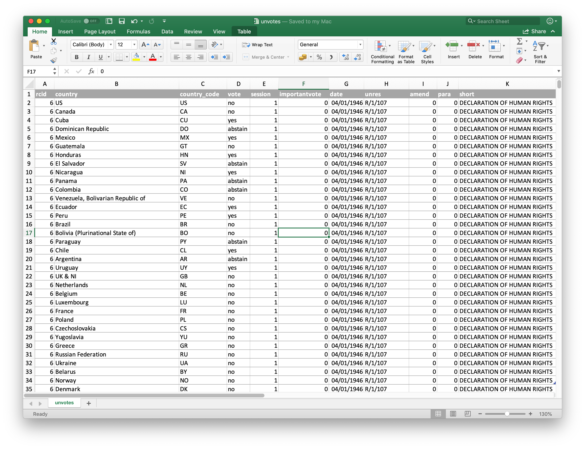
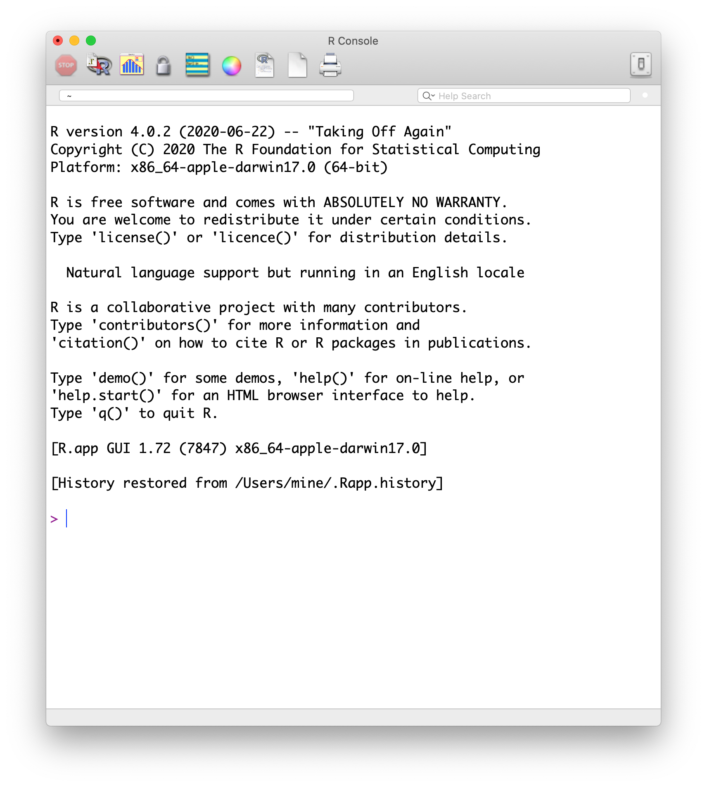
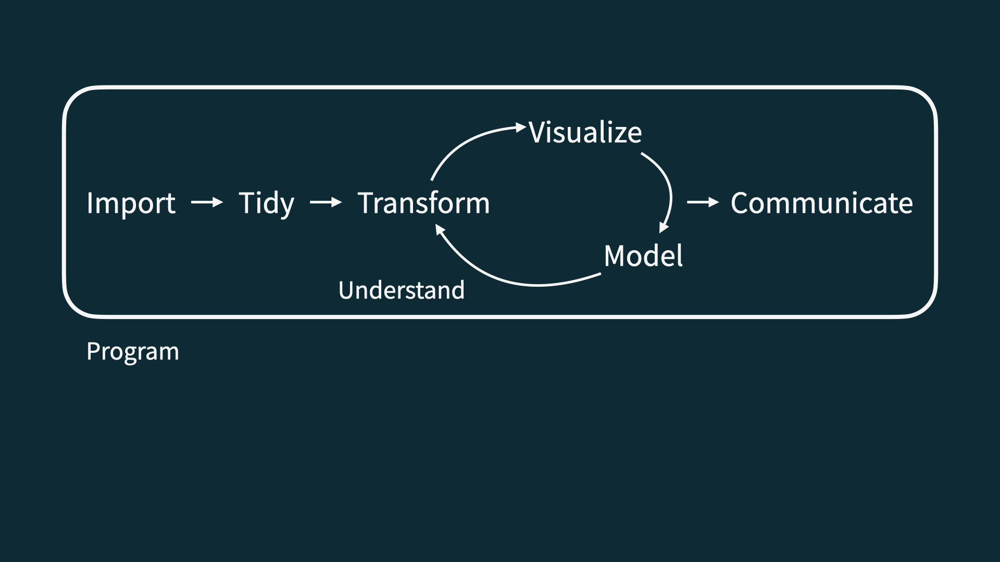
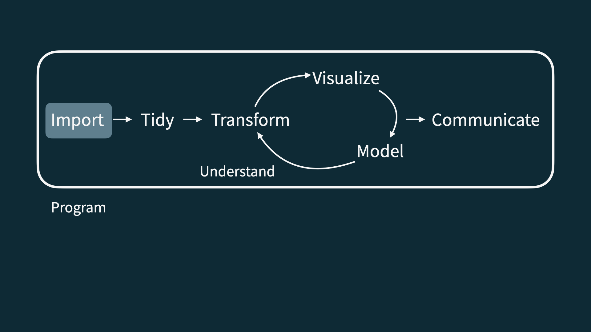
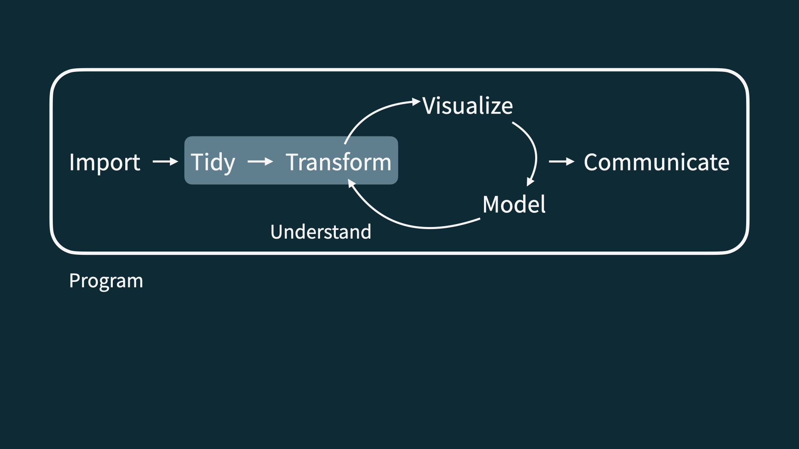
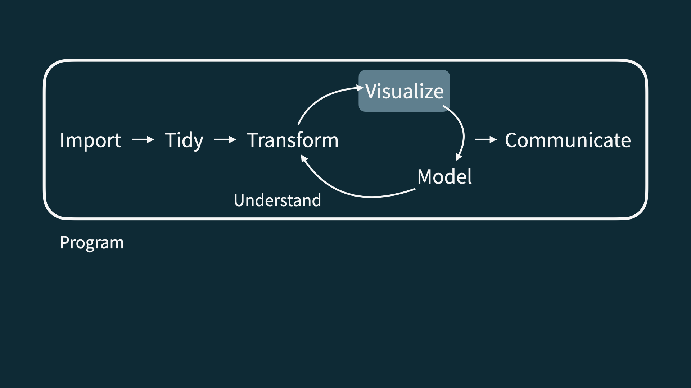
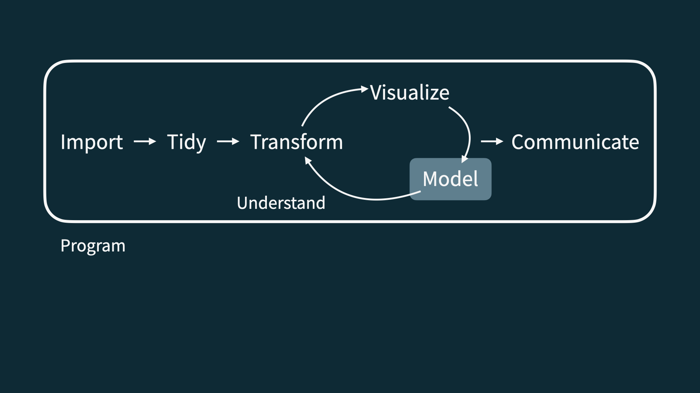
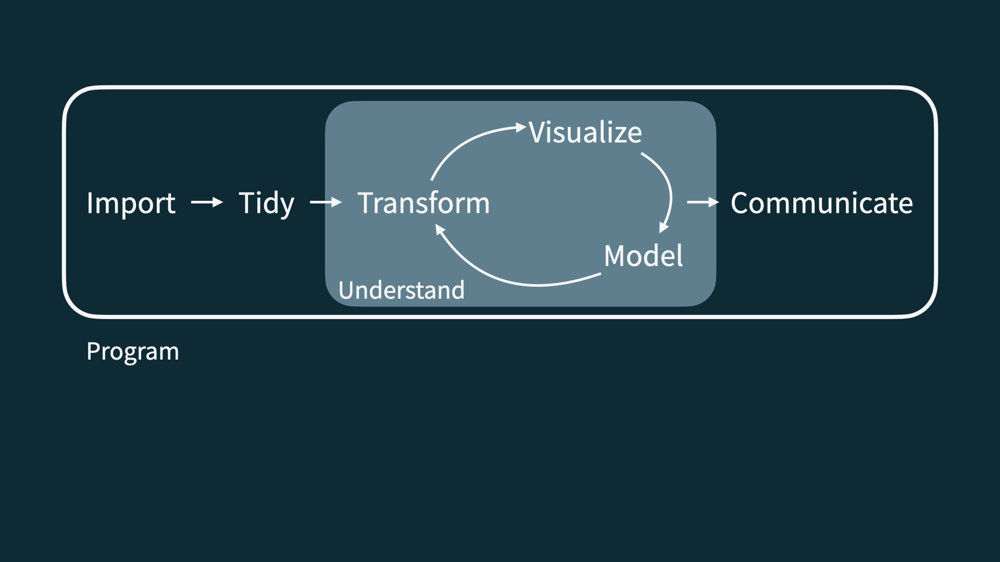

```{r child = "../setup.Rmd"}
```

```{r packages, echo=FALSE, message=FALSE, warning=FALSE}
library(tidyverse)
library(viridis)
library(sugrrants)
library(lubridate)
```


class: middle

# Software

---

```{r echo=FALSE, out.width="75%", fig.align="left"}

```

???

Before I did my undergraduate this is what data analysis mostly meant to me. Now this form of data in rows and columns may be familiar to some of you if you have worked with excel and spreadsheets. Now many of us if we are collecting data like to put it into something like this. 

So data that comes in a tabular format like this might be familiar to you. 

---

```{r echo=FALSE, out.width="50%", fig.align="left"}

```

???
When I did my undergraduate thesis and started learning R this is what R looked like. I remember thinking of the interface as a black box and I wasn't really sure where the data was contained.  

---

```{r echo=FALSE, out.width="73%", fig.align="left"}
knitr::include_graphics("img/rstudio.png")
```

???

In this course we are going to be using something a little bit different. We are going to be using Posit to interact with the computing language. If you remember the images from the previous two slides you can see that Posit combines those two components so that you can view the data and also execute code in the console. Posit is the Integrated Development Environment (IDE) that we are going to use in this course.

---

class: middle

# Data science life cycle

---

```{r echo=FALSE, out.width="90%", fig.align="left"}

```

???
Let's also talk about the Data Science Life Cycle. This is the diagram from the book R for Data Science that we'll be referring to throughout the course. Note that this isn't the only diagram out there representing the data science life cycle but it is the one that we are using to structure this course. 

So how does the data science life cycle begin?
---

```{r echo=FALSE, out.width="90%", fig.align="left"}

```

???
Usually you have some data maybe in a spreadsheet or a database and you need to import into R.

---

```{r echo=FALSE, out.width="90%", fig.align="left"}

```

???

Then we need to spend some time organising that data to make it easier to use and analyse. This often includes doublechecking the data for mistakes and tidying it and it may also include transforming it to get it to the table that you want, that makes it easier to use or analyse. 

---

```{r echo=FALSE, out.width="90%", fig.align="left"}

```

???

Once the data is in a format that is easy to work with, you want to visualize your data to start to gain some insights from it. 
---

```{r echo=FALSE, out.width="90%", fig.align="left"}

```

???
Then, perhaps you will go onto modelling your data.

---

```{r echo=FALSE, out.width="90%", fig.align="left"}

```

???
And the reality is it never ends there. You will gain more insight into the data and you may need to go back and check and adjust your assumptions. 

That last step is communicating your results and finding. 

---


## Course toolkit

<br>

.pull-left[
### .gray[Course operation]
.gray[
- [bates-dataviz.netlify.app](https://bates-dataviz.netlify.app/)
- [Google classroom](https://classroom.google.com/)
]
]
.pull-right[
### .pink[Doing data science]
- .pink[Programming:]
  - .pink[R]
  - .pink[Posit]
  - .pink[tidyverse]
  - .pink[Quarto]
<!-- - .gray[Version control and collaboration:] -->
<!--   - .gray[Git] -->
<!--   - .gray[GitHub] -->
]

---

## Learning goals

By the end of the course, you will be able to...

--

- gain insight from data

--
- gain insight from data, **reproducibly**

--
- gain insight from data, reproducibly, **using modern programming tools and techniques**

--
- gain insight from data, reproducibly **and collaboratively**, using modern programming tools and techniques

--
- gain insight from data, reproducibly **(with literate programming)** and collaboratively, using modern programming tools and techniques

---

class: middle

# Reproducible data analysis

---

## Reproducibility checklist

.question[
What does it mean for a data analysis to be "reproducible"?
]

--

Near-term goals:

- Are the tables and figures reproducible from the code and data?
- Does the code actually do what you think it does?
- In addition to what was done, is it clear *why* it was done? 

Long-term goals:

- Can the code be used for other data?
- Can you extend the code to do other things?

---

## Toolkit for reproducibility

- Scriptability $\rightarrow$ .pink[R]
- Literate programming (code, narrative, output in one place) $\rightarrow$ .pink[R Markdown/Quarto and Quarto]
<!-- - Version control $\rightarrow$ .pink[Git / GitHub] -->

---

class: middle

# R and Posit

---

## R and Posit

.pull-left[
```{r echo=FALSE, out.width="25%"}
knitr::include_graphics("img/r-logo.png")
```
- R is an open-source statistical **programming language**
- R is also an environment for statistical computing and graphics
- It's easily extensible with *packages*
]
.pull-right[
```{r echo=FALSE, out.width="50%"}
knitr::include_graphics("img/rstudio-logo.png")
```
- Posit is a convenient interface for R called an **IDE** (integrated development environment), e.g. *"I write R code in the Posit IDE"*
- Posit is not a requirement for programming with R, but it's very commonly used by R programmers and data scientists
]


---

## R packages

- **Packages** are the fundamental units of reproducible R code. They include reusable R functions, the documentation that describes how to use them, and sample data<sup>1</sup>

- As of September 2020, there are over 16,000 R packages available on **CRAN** (the Comprehensive R Archive Network)<sup>2</sup>

- We're going to work with a small (but important) subset of these!

.footnote[
<sup>1</sup> Wickham and Bryan, [R Packages](https://r-pkgs.org/).

<sup>2</sup> [CRAN contributed packages](https://cran.r-project.org/web/packages/).
]

---

## Tour: R and Posit

```{r echo=FALSE, out.width="80%"}
knitr::include_graphics("img/tour-r-rstudio.png")
```

---

## A short list (for now) of R essentials

- Functions are (most often) verbs, followed by what they will be applied to in parentheses:

```{r eval=FALSE}
do_this(to_this)
do_that(to_this, to_that, with_those)
```

--

- Packages are installed with the `install.packages` function and loaded with the `library` function, once per session:

```{r eval=FALSE}
install.packages("package_name")
library(package_name)
```

---

## R essentials (continued)

- Columns (variables) in data frames are accessed with `$`:

.small[
```{r eval=FALSE}
dataframe$var_name
```
]

--

- Object documentation can be accessed with `?`

```{r eval=FALSE}
?mean
```

---

## tidyverse

.pull-left[
```{r echo=FALSE, out.width="99%"}
knitr::include_graphics("img/tidyverse.png")
```
]

.pull-right[
.center[.large[
[tidyverse.org](https://www.tidyverse.org/)
]]

- The **tidyverse** is an opinionated collection of R packages designed for data science
- All packages share an underlying philosophy and a common grammar
]

---

## rmarkdown and quarto

.pull-left[
.center[.large[
[rmarkdown.rstudio.com](https://rmarkdown.rstudio.com/)
]]

- **rmarkdown** and **quarto** and the various packages that support it enable R users to write their code and prose in reproducible computational documents
- We will generally refer to R Markdown/Quarto documents (with `.Rmd` extension) and Quarto documents (with `.qmd` extension)
]

.pull-right[
```{r echo=FALSE, out.width="60%"}
knitr::include_graphics("img/rmarkdown.png")
```
]

---

class: middle

# R Markdown/Quarto

---


## R Markdown/Quarto

- Fully reproducible reports -- each time you render the analysis is ran from the beginning
- Simple markdown syntax for text
- Code goes in chunks, defined by three backticks, narrative goes outside of chunks

---

## Tour: R Markdown/Quarto and Quarto

```{r echo=FALSE, out.width="90%"}
knitr::include_graphics("img/tour-rmarkdown.png")
```

---

## Environments

.tip[
The environment of your R Markdown/Quarto document is separate from the Console!
]

Remember this, and expect it to bite you a few times as you're learning to work 
with R Markdown/Quarto!

---

## Environments

.pull-left[
First, run the following in the console

.small[
```{r eval = FALSE}
x <- 2
x * 3
```
]

.question[
All looks good, eh?
]
]

--

.pull-right[
Then, add the following in an R chunk in your R Markdown/Quarto document

.small[
```{r eval = FALSE}
x * 3
```
]

.question[
What happens? Why the error?
]
]

---

## R Markdown/Quarto help

.pull-left[
.center[
.midi[R Markdown/Quarto Cheat Sheet  
`Help -> Cheatsheets`]
]
```{r echo=FALSE, out.width="80%"}
knitr::include_graphics("img/rmd-cheatsheet.png")
```
]
.pull-right[
.center[
.midi[Markdown Quick Reference  
`Help -> Markdown Quick Reference`]
]
```{r echo=FALSE, out.width="80%"}
knitr::include_graphics("img/md-cheatsheet.png")
```
]

---

## How will we use R Markdown/Quarto?

- Every assignment / report / project / etc. is an R Markdown/Quarto document
- You'll always have a template R Markdown/Quarto document to start with
- The amount of scaffolding in the template will decrease over the semester

---

## What's with all the hexes?

```{r echo=FALSE, out.width="60%"}
knitr::include_graphics("img/hex-australia.png")
```

.footnote[
Mitchell O'Hara-Wild, [useR! 2018 feature wall](https://www.mitchelloharawild.com/blog/user-2018-feature-wall/)
]

---

.your-turn[
.light-blue[.hand[Your turn:]] `AE 02 - Bechdel + R Markdown/Quarto`
- [The Bechdel test](https://en.wikipedia.org/wiki/Bechdel_test) asks whether a work of fiction features at least two women who talk to each other about something other than a man, and there must be two women named characters.
- Go to [PositCloud](https://posit.cloud/) and start the assignment `AE 02 - Bechdel + R Markdown/Quarto`. 
- Open and knit the R Markdown/Quarto document `bechdel.Rmd`, review the document, and fill in the blanks.
]

---
## Acknowledgements

* This course builds on the materials from [Data Science in a Box](https://datasciencebox.org/) developed by Mine Çetinkaya-Rundel and are adapted under the [Creative Commons Attribution Share Alike 4.0 International](https://github.com/rstudio-education/datascience-box/blob/master/LICENSE.md)
