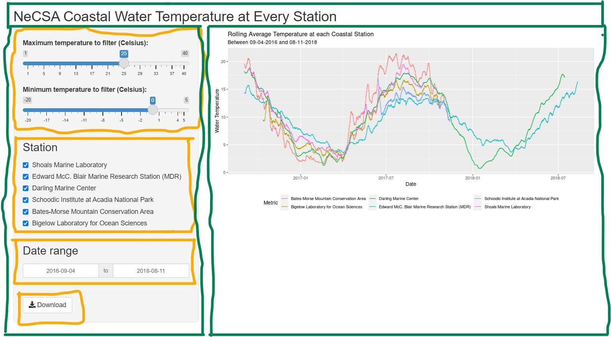

```{r child = "../setup.Rmd"}
```

## Shiny

.pull-left[
- Shiny is an R package that makes it easy to build interactive web apps straight from R
- You can host standalone apps on a webpage or embed them in R Markdown documents or build dashboards
- You can also extend your Shiny apps with CSS themes, htmlwidgets, and JavaScript actions
- Learn more at [shiny.rstudio.com](https://shiny.rstudio.com/)
]
.pull-right[
```{r echo=FALSE, fig.align = "left"}
knitr::include_graphics("img/shiny.png")
```
]

---

## High level view

- Every Shiny app has a webpage that the user visits, and behind this webpage there is a computer that serves this webpage by running R

- When running your app locally, the computer serving your app is your computer

- When your app is deployed, the computer serving your app is a web server

---

.center[
[laurie-the-student-baker.shinyapps.io/NeCSA_Temperature_Outliers/](https://laurie-the-student-baker.shinyapps.io/NeCSA_Temperature_Outliers/)
]

.center[
<iframe width="1000" height="500" src="https://laurie-the-student-baker.shinyapps.io/NeCSA_Temperature_Outliers/" frameborder="0" allow="accelerometer; autoplay; encrypted-media; gyroscope; picture-in-picture" allowfullscreen></iframe>  
]

Credit: Created by students in [Community-Engaged Data Science](https://community-engaged-data-science.netlify.app/) at Bates.


---

.center[
[laurie-the-student-baker.shinyapps.io/NeCSA_Temperature_Outliers/](https://laurie-the-student-baker.shinyapps.io/NeCSA_Temperature_Outliers/)
]

.center[
<iframe width="1000" height="500" src="https://laurie-the-student-baker.shinyapps.io/NeCSA_Temperature_Outliers/" frameborder="0" allow="accelerometer; autoplay; encrypted-media; gyroscope; picture-in-picture" allowfullscreen></iframe>  
]

What does the app do?

---


class: middle

# Anatomy of a Shiny app

---

## What's in a Shiny app

.pull-left[

```{r shiny_ex, eval = FALSE}
library(shiny)

ui <- fluidPage()

server <- function(input, output){}

shinyApp(ui = ui, server = server)
```


]

.pull-right[

- **User interface (ui)** controls the layout and appearance of the app.
- **Server function (server)** contains instructions needed to build the app

]

---

## The User Interface (ui)

- Spot the 4 widgets that allow the user to interact with the app. What do they do?

- The user interface is divided into 3 parts: a title panel, a main panel, and a side bar panel. Can you identify which is which?

```{r picture-side-panel, echo = FALSE}

```

