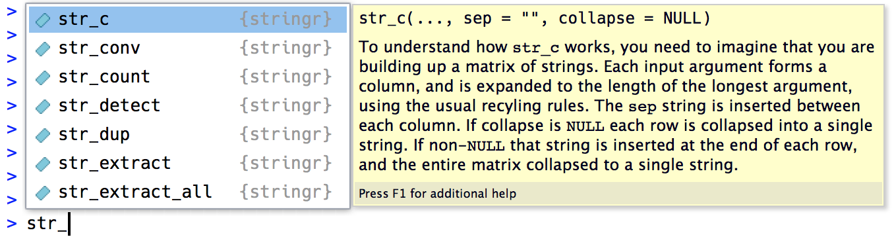

```{r child = "../setup.Rmd"}
```

```{r packages, echo = FALSE, message=FALSE, warning=FALSE}
library(tidyverse)
library(tidytext)
```

class: middle

# Working with strings using stringr and regex

---

```{r echo=F}
library(stringr)
```

## Introduction

> Strings play a big role in many data cleaning and preparations tasks.

- Character strings in R are wrapped with double (`"`) or single quotes (`'`).
  - Character strings can be letters "a", 
                             numbers "1", 
                             symbols "&", 
                             or both "a1&"

- *the [tidyverse style guide](https://style.tidyverse.org/syntax.html#character-vectors) recommends using `"` unless the string contains multiple `"`.

---

## stringr

- `stringr` is a lightweight package designed by Hadley Wickham to assist with string manipulation.
- `stringr` functions begin with `str_`. Follow with + TAB to see the options.

```{r stringr functions, echo = FALSE, fig.width = 3, fig.cap = "Stringr autocomplete functions from R4DS", eval = TRUE}

```

---

## Overview

- Getting Started with stringr
- Basic String Operators
- Special Characters

---

## Getting Started

#### Loading stringr

```{r warning = F, message = F, eval = F}
install.packages("stringr")
library(stringr)
```

```{r small = T}
movie_titles <- c("gold diggers of broadway", "gone baby gone", 
    "gone in 60 seconds", "gone with the wind", "good girl, the", 
    "good burger", "goodbye girl, the", "good bye lenin!", 
    "goodfellas", "good luck chuck", "good morning, vietnam", 
    "good night, and good luck.", "good son, the", "good will hunting")

strings <- c(" 219 733 8965", "329-293-8753 ", "banana", "595 794 7569",
  "387 287 6718", "apple", "233.398.9187  ", "482 952 3315", 
  "239 923 8115 and 842 566 4692", "Work: 579-499-7527", "$1000", "Home: 543.355.3679")

```

---
## Basic String Operators

- String operators are basic string manipulation functions
- Many of them have equivalent base R functions that are much slower and bulkier

---
## str_to_upper(string)
    - converts strings to uppercase
      - ex. Convert all movie_titles to uppercase and store them as movie_titles

```{r}
movie_titles <- str_to_upper(movie_titles)
movie_titles
```

---
## str_to_lower(string)
    - converts strings to lowercase
      - ex. Convert all movie_titles back to lowercase and save as movie_titles
      
```{r}
movie_titles <- str_to_lower(movie_titles)
movie_titles
```

---
## str_to_title(string)
    - converts strings to title case
      - ex. Convert all movie_titles to titlecase and store them as movie_titles

```{r}
movie_titles <- str_to_title(movie_titles)
movie_titles
```

---
## `str_length(string)`
    - Returns the string length
    - `str_length()` converts factors to strings and also preserves NA's
    
```{r small = T}
str_length("hello")
```

---
## `str_c(string, sep = "")`
    - Joins together multiple strings including integers
    - Is the stringr equivalent to `paste(sep = "")` or `paste0()`

## `str_dup(string, times)`
    - Duplicates strings by a number of times.
    - Essentially copy / paste function
    
```{r}
str_c("Heartbreakers gonna ", str_dup("break, ", 3), "break")
```

---
## `str_sub(string, start, end)`
    - Subsets text within a string or vector of strings by specifying
      start and end positions.
    - Base equivalent function is `substr()`

```{r}
str_sub("Dr Jekyll", start = 1, end = 2)
```

---
## `str_trim(string)`
    - Removes leading and trailing whitespaces
    - `side = c("both", "left", "right")` Side argument defaults to "both"
    - example: trim the whitespace from both sides of every string in strings
 
```{r small = T}
str_trim(strings, side = "both")
```

---
## `str_pad()`
    - Pads strings with whitespace to make them a certain length
    - Width argument lets users specify the width of the padding
    - Side argument defaults to "left"
    - ex. pad "movie_titles" with whitespace to the right such that each title 
      becomes 30 characters long.

```{r small = T}
str_pad(movie_titles, side = "right", width = 30)
```

---
## Making sentences with `str_glue`

```{r}
ship_log <- tibble(locations = c("Bar Harbor, Mt. Desert Rock, Great Cranberry Island", "Winter Harbor, Stave Island", "Bass Rock"),
             day = c("Monday", "Tuesday", "Monday"))

ship_log |>
  mutate(account = str_glue("On {day} we went to {locations}"))
```

---
# Summarize strings with `str_flatten`

- `str_flatten()` takes a character vector and combines each element of the vector into a single string.

```{r}
purchases <- data.frame(fruit, name = c("Carmen", "Carmen", "Aziz", "Maganga"))

purchases |>
  group_by(name) |>
  summarize(fruits = str_flatten(fruit, ", ", last = " and "))
```

---
# Extracting data from strings

- Separating into rows: `separate_longer_delim`
- Separating into columns: `separate_wider_delim`

*similar to `pivot_longer()` and `pivot_wider()`. Helpful when there is information contained within the text that should be in columns or their own row.

---
# Separate into rows

```{r}
ship_log <- tibble(locations = c("Bar Harbor, Mt. Desert Rock, Great Cranberry Island", "Winter Harbor, Stave Island", "Bass Rock"),
             day = c("Monday", "Tuesday", "Thursday"))
ship_log |> 
  separate_longer_delim(locations, delim = ",")
```
---
# Separate into columns by delimiter

```{r}
df <- tibble(quote = c("LB: What did you have for breakfast today?", "GK: Toast and a cup of coffee.", "LB: When did you first become involved in fishing?", "GK: When I was a kid, I used to go out with my uncle Bobby"))
df |> 
  separate_wider_delim(quote, 
                       delim = ":",
                       names = c("speaker", "quote"))
```
---
# Separate into columns by position

```{r}
df2 <- tibble(term = c("S19", "F19", "W20", "S20", "F20"))
df2 |> 
  separate_wider_position(term, 
                          widths = c(term = 1, year = 2))
```
---
### Combining `stringr` functions

```{r}
df2 <- tibble(term = c("S19", "F19", "W20", "S20", "F20"))
df2 |> 
  separate_wider_position(term, 
                          widths = c(term = 1, year = 2)) |>
  mutate(year = str_c("20", year))
```
---
# Special characters in strings

- Some characters require an **escape** (`\`) to put the non-printable character into a string.

- To see the raw contents of the string use `str_view()`


```{r}
double_quote = "\""
single_quote = "\'"
backslash = "\\"
newline = "first line \n second line"

x <- c(double_quote, single_quote, backslash, newline)
x
str_view(x)
```
---
# Thank you